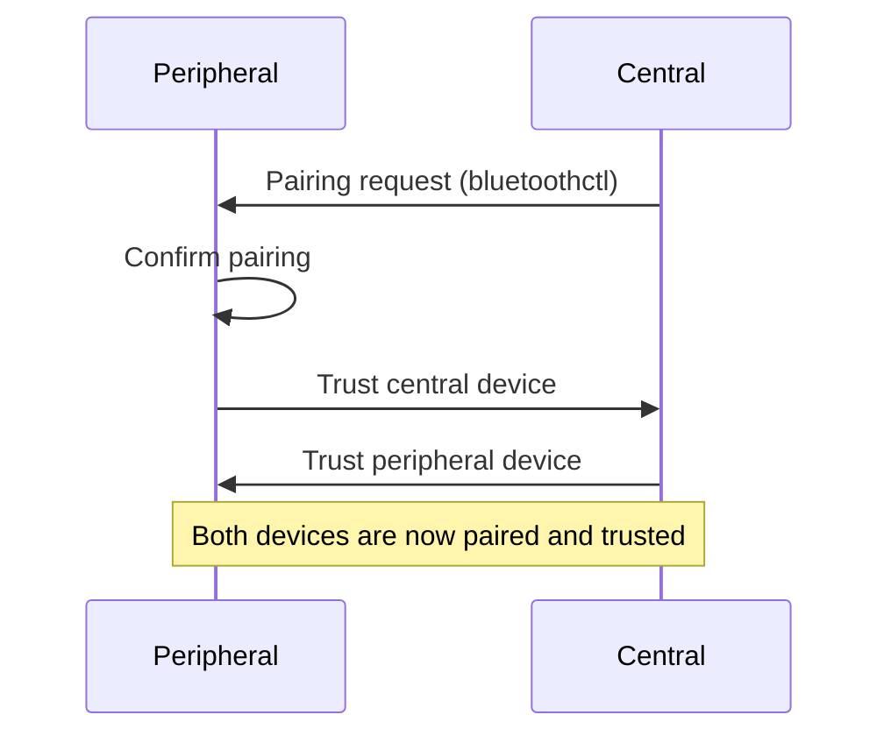
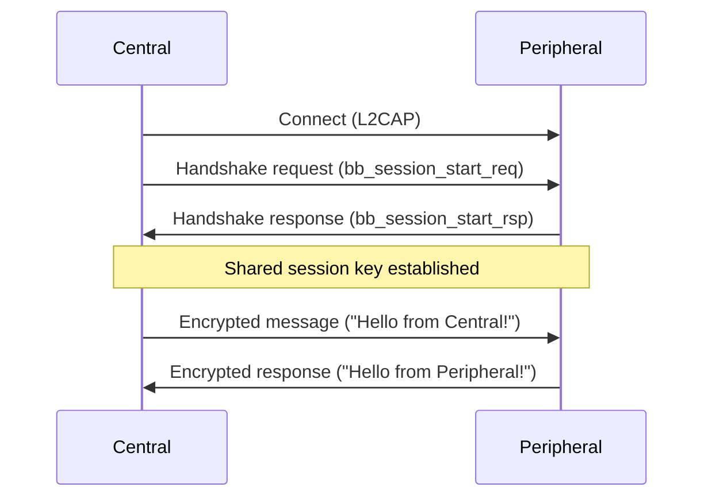

# BlueBrothers Protocols - Complete Workflow Guide

This document provides a workflow for running the bb-protocols on RPi/Linux, including the pairing process that was missing in the original [README](https://github.com/sacca97/bb-protocols/tree/main/bb-portable).

## Overview

BB-portable implements the BlueBrothers protocols over L2CAP for Bluetooth Classic (BR/EDR) in the `central.c` and `peripheral.c` files. It leverages the bb-lib, a C library that implements the underlying cryptographic primitives and protocol logic.

## Prerequisites

- Linux with Bluetooth Classic (BR/EDR) support - the primary target is the Raspberry Pi 4B with Raspberry Pi OS (Debian 12 Bookworm)
- Make, CMake, GCC
- Bluetooth utilities (bluetoothctl)
- Two Bluetooth-enabled devices

On the Raspberry Pi OS:

```bash
sudo apt install libbluetooth-dev cmake make gcc
```


## Building

```bash
cd bb-portable
cmake .
make central
make peripheral
```

## Complete Workflow

### Phase 1: Device Pairing (REQUIRED)

>⚠️ **IMPORTANT**: <br>The original README omitted the crucial pairing step. You **must** pair and trust the devices before running the protocol.
<br>

#### On the Peripheral Device:

1. **Start bluetoothctl and configure the adapter:**
   ```bash
   sudo bluetoothctl
   ```
   
2. **Configure the Bluetooth adapter:**
   ```
   [bluetooth]# agent on
   [bluetooth]# default-agent
   [bluetooth]# discoverable on
   [bluetooth]# pairable on
   ```

   **Note:** The `discoverable on` mode has a timeout. Running the command again before the central device initiates pairing will not cause any issues. 

3. **Check your device address:**
   ```
   [bluetooth]# show
   ```
   Note down the Controller address (e.g., `AA:BB:CC:DD:EE:FF`), as it's easier than searching for it among all scanned devices.

4. **Wait for pairing request from central device** - you'll see:
   ```
   [NEW] Device 11:22:33:44:55:66 raspberrypi2
   Request confirmation
   ```
   Confirm the pairing request.

5. **Trust the central device:**
   ```
   [bluetooth]# trust 11:22:33:44:55:66
   ```
   Replace `11:22:33:44:55:66` with the actual central device address.

6. **Exit bluetoothctl:**
   ```
   [bluetooth]# quit
   ```

#### On the Central Device:

1. **Start bluetoothctl:**
   ```bash
   sudo bluetoothctl
   ```

2. **Configure the adapter:**
   ```
   [bluetooth]# agent on
   [bluetooth]# discoverable on
   [bluetooth]# pairable on
   ```

3. **Pair with the peripheral device:**
   ```
   [bluetooth]# scan on
   ```
   Wait for the peripheral device to be scanned.
   ```
   [bluetooth]# scan off
   [bluetooth]# pair AA:BB:CC:DD:EE:FF
   ```
   Replace `AA:BB:CC:DD:EE:FF` with the actual peripheral device address.

4. **Trust the peripheral device:**
   ```
   [bluetooth]# trust AA:BB:CC:DD:EE:FF
   ```

5. **Exit bluetoothctl:**
   ```
   [bluetooth]# quit
   ```

### Phase 2: Running the Protocol

#### On the Peripheral Device:

```bash
sudo ./bin/peripheral
```

Expected output:
```
Changing power on succeeded
Changing discoverable on succeeded
Changing pairable on succeeded
Start Bluetooth L2CAP server...
IMPORTANT: Make sure adapter is discoverable via 'bluetoothctl'
Binding to PSM 0x0235
Listening...
Accepted connection from 11:22:33:44:55:66
Handshake complete, key:
b085ad7c1eac778251511dfadfecba2cf464452f4559f5b3bcc54a323e99eef2
Server finished.
```

#### On the Central Device:

```bash
sudo ./bin/central AA:BB:CC:DD:EE:FF
```

Expected output:
```
Starting Bluetooth L2CAP client...
Connecting to AA:BB:CC:DD:EE:FF on PSM 0x0235...
Connected successfully!
Handshake complete, key:
b085ad7c1eac778251511dfadfecba2cf464452f4559f5b3bcc54a323e99eef2
Client finished.
```

## Important Notes

- **Hardcoded Keys**: The executables contain hardcoded keys for demonstration purposes
- **Protocol Assumption**: The demo assumes bb-pairing has already happened and runs bb-session
- **Successful Execution**: Both devices should show the same shared key upon successful completion
- **Order Matters**: Always start the peripheral device first, then the central device

## Visual Protocol Overview

### Device Pairing Sequence



*Figure: Both devices must be paired and trusted before protocol communication can begin.*

### Protocol Handshake & Secure Message Exchange



*Figure: Secure handshake and encrypted message exchange using the BlueBrothers protocol.*


## Troubleshooting

### Common Issues:

1. **Connection Refused**: Ensure devices are paired and trusted
2. **Permission Denied**: Run with `sudo` privileges
3. **Device Not Found**: Verify the MAC address is correct
4. **Pairing Fails**: Make sure both devices are discoverable and pairable

### Verification Steps:

1. Check if devices are paired:
   ```bash
   bluetoothctl paired-devices
   ```

2. Check if devices are trusted:
   ```bash
   bluetoothctl info <device-address>
   ```

