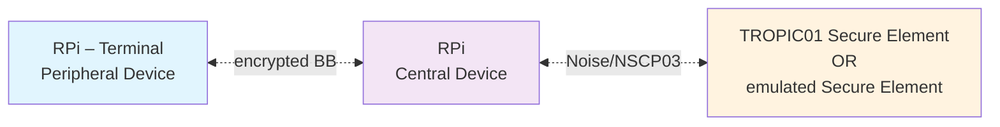

# ORSHIN Demonstrator Platform (WP3, WP4, WP5)

This repository contains the ORSHIN demonstrator platform integrating following ORSHIN deliverables and related assets:
  - [BlueBrothers-protocols](https://github.com/sacca97/bb-protocols)
  - [New Secure Channel Protocol 03](https://github.com/securitypattern/orshin-STM32-client-scp03-nscp)
  - [AttackDefense Framework (ADF)](https://github.com/tropicsquare/orshin-adf)
  - [TROPIC01 Secure Element](https://github.com/tropicsquare/tropic01)

## Architecture




The Demonstrator platform consists of two RPi devices: the first RPi acts as a terminal, and the second RPi acts as a remote host with a connected secure element that provides remote secure services to the terminal RPi.

Wireless communication between the RPi devices is secured by the **BlueBrothers-protocol** over BLE.

Two secure elements can be used interchangeably on the second RPi:
- the TROPIC01 physical chip (as an RPi extension shield or a USB plug)
- the RISC-V-emulated Secure Element implementing the **New Secure Channel Protocol 03** over SPI

## Repository Structure

- **examples** – software examples for the demo platform
- **threat-model** – threat model for the demo platform using the **AttackDefense Framework (ADF)** and **MITRE EM3ED**
- **orshin-sc-fpga** – dependencies for enabling the RISC-V-emulated Secure Element
- **tropic01-se** – dependencies for enabling the TROPIC01 physical Secure Element


## Get Started!

```bash
git clone --recurse-submodules https://github.com/tropicsquare/orshin-demo
```

**Demo Bringup:**

- Follow the [Bill of Materials](BOM.md) to acquire hardware needed for the complete demo setup.
- Follow the [BB_BRINGUP.md](BB_BRINGUP.md) guide to enable secure communication between two RPis.
- Follow:
  * [TROPIC01_BRINGUP.md](TROPIC01_BRINGUP.md) guide to configure both RPis with the TROPIC01 physical Secure Element,
  * or [ORSHIN_SC_BRINGUP.md](ORSHIN_SC_BRINGUP.md) guide to configure both RPis with the RISC-V-emulated Secure Element.


## Examples

Several software examples are available for the demonstrator platform, and several software components need to be orchestrated to bring-up the platform.

To enable the BlueBrothers protocol serving for secure communication, follow [BlueBrothers protocols over L2CAP for Bluetooth Classic (BR/EDR)](BB_BRINGUP.md) instructions.
To enable TROPIC01 secure element, providing cryptografic functions in certain demo configurations, follow [TROPIC01 Secure Element Enablement](TROPIC01_BRINGUP.md) instructions.

Following examples are available for the ORSHIN demo:

  - [Secure Bluetooth L2CAP communication using the BB protocol with AEAD encryption](examples/BB-Communication_Example/)
  - [A lightweight, secure implementation for Bluetooth communication with the TROPIC01 secure element.](examples/BB-TP01_Integration/)
  - [Tetris Game with the TROPIC01 Secure Element](examples/Tetris_TP01/)


## Demonstrator Threat Model

The Demonstrator platform Threat model was created by employing the **Attack Defense**, and the [MITRE EM3ED Threat Model](https://emb3d.mitre.org/) frameworks.

TODO:
  - [ ] implement [Threat model](adf/README.md)


# About ORSHIN
It is common wisdom that cyber security is only as strong as the weakest link in a chain. Therefore, the main challenge is to identify the critical points of IoT infrastructure. To address this issue, ORSHIN is creating the first generic and integrated methodology, called trusted lifecycle, to develop secure network devices based on open-source components while managing their entire lifecycle. ORSHIN's trustworthy lifecycle consists of different phases (design, implementation, evaluation, installation, maintenance and retirement) that form a chain of trust. This lifecycle defines how the safety objectives are translated into policies for defined phases. Using this holistic view, ORSHIN will address critical links, reduce threats and improve security of open-source devices.

# About Tropic Square
[Tropic Square](https://tropicsquare.com) develops open-architecture secure elements on the foundation of Security through Transparency. We invite testing and evaluation to verify the reliability of our products.

[TROPIC01](https://github.com/tropicsquare/tropic01)  is the first product in its lineup, serving as a cryptographic coprocessor that establishes a hardware root of trust, ensuring the protection of the system’s most sensitive assets while offloading cryptographic functions from the host MCU.

# Acknowledgement
Funded by the European Union under grant agreement no. 101070008. Views and opinions expressed are however those of the author(s) only and do not necessarily reflect those of the European Union. Neither the European Union nor the granting authority can be held responsible for them.
