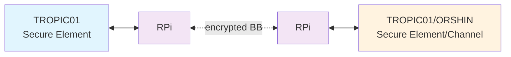

# ORSHIN Demonstrator Platform (WP3, WP4, WP5)

This repository contains the ORSHIN demonstrator platform integrating following ORSHIN deliverables and related assets:
  - [BlueBrothers-protocols](https://github.com/sacca97/bb-protocols)
  - [Secure Element implementation](secure-element/)
  - [AttackDefense Framework (ADF)](https://github.com/tropicsquare/orshin-adf)
  - [New Secure Channel Protocol 03](https://github.com/securitypattern/orshin-STM32-client-scp03-nscp)
  - [TROPIC01 Secure Element](https://github.com/tropicsquare/tropic01)

## Architecture




TODO:
  - [ ] Describe architecture
  - [x] Create the final block diagram
  - [ ] Describe HW setup flavours


## Repostory Structure

TBD

## Get Started!

```bash
git clone --recurse-submodules https://github.com/tropicsquare/orshin-demo
```

## Examples

Several software examples are available for the demonstrator platform, and several software components need to be orchestrated to bring-up the platform.

To enable the BlueBrothers protocol serving for secure communication, follow [BlueBrothers protocols over L2CAP for Bluetooth Classic (BR/EDR)](BB_BRINGUP.md) instructions.
To enable TROPIC01 secure element, providing cryptografic functions in certain demo configurations, follow [TROPIC01 Secure Element Enablement](TROPIC01_BRINGUP.md) instructions.

Following examples are available for the ORSHIN demo:

  - [Secure Bluetooth L2CAP communication using the BB protocol with AEAD encryption](examples/BB-Communication_Example/)
  - [A lightweight, secure implementation for Bluetooth communication with the TROPIC01 secure element.](examples/BB-TP01_Integration/)
  - [Tetris Game with the TROPIC01 Secure Element](examples/Tetris_TP01/)


## Demonstrator Threat Model: Attack Defense Framework

TODO:
  - [ ] implement [Threat model](adf/README.md)


