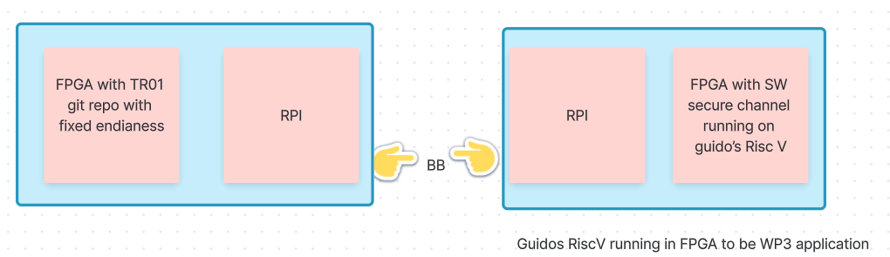

# ORSHIN Demonstrator Platform (WP3, WP4, WP5)

## ORSHIN Demonstrator Platform Architecture

TODO:
  - [ ] Describe architecture
  - [ ] Create the final block diagram

## Attack Defense Framework

TODO:
  - [ ] implement [Threat model](adf/README.md)

## Inter-Device Communication

TODO:
  - [ ] evaluate and integrate [BlueBrothers-protocols](https://github.com/sacca97/bb-protocols)

## Intra-Device Communication

TODO:
  - [ ] evaluate and integrate [Secure Channel Protocol 03](https://github.com/securitypattern/orshin-STM32-client-scp03-nscp)

## ORSHIN Secure Element

TODO:
  - [ ] integrate [ORSHIN Secure Element implementation](secure-element/)

Dependencies:
  - [modified nano-package library](https://github.com/securitypattern/orshin-rpi_scp03)

## TROPIC01 Secure Element

TODO:
  - [ ] integrate [TROPIC01](https://github.com/tropicsquare/tropic01) FPGA or chip - To be decided

