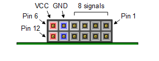

# Demo Boards Interconnect

- To simplify demo setup, it is recommended to connect both RPi devices to the local LAN using Ethernet cables, allowing remote SSH access to both devices.

- For the demo configuration with the TROPIC01 Secure Element:
  - Connect the [Raspberry Pi Development Kit](https://145324096.hs-sites-eu1.com/order-tropic01) to the RPi 40-pin header.
  - OR connect the [USB stick with TROPIC01](https://145324096.hs-sites-eu1.com/order-tropic01) to the RPi USB-A port.

- For the demo configuration with the RISC-V–emulated Secure Element:
  - Connect the [Digilent Nexys A7](https://www.amd.com/en/corporate/university-program/aup-boards/digilent-nexys-a7.html) JC [PMOD PORT](https://digilent.com/reference/_media/reference/programmable-logic/nexys-a7/nexys-a7_rm.pdf) via the I2C bus to the central [RPi 40-PIN header](https://www.raspberrypi.com/documentation/computers/raspberry-pi.html). Use short DuPont M-M cables or similar wiring. See the pinout table and schematics below.
  - Move the  [Digilent Nexys A7](https://www.amd.com/en/corporate/university-program/aup-boards/digilent-nexys-a7.html) J15 switch to the upper position to enable debugger function.

| Function      | RPi PIN Name/#       | Digilent Nexys A7 PMOD JC PIN #  |
| ------------- | ------------- | ------------- |
| SDA           | GPIO 2 (SDA)/3       |     10                           |
| SCL           | GPIO 3 (SCL)/5       |      9                           |
| GND           | GROUND/9             |     11                           |

<table>
  <tr>
    <td align="center">
       
      PMOD PORT: https://digilent.com/reference/_media/reference/programmable-logic/nexys-a7/nexys-a7_rm.pdf
    </td>
    <td align="center">
       
      RPi 40-PIN header: https://www.raspberrypi.com/documentation/computers/raspberry-pi.html
    </td>
  </tr>
</table>

