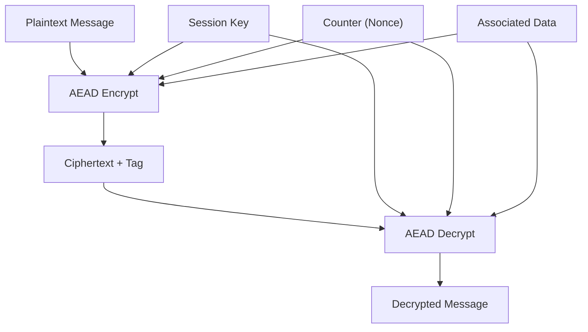
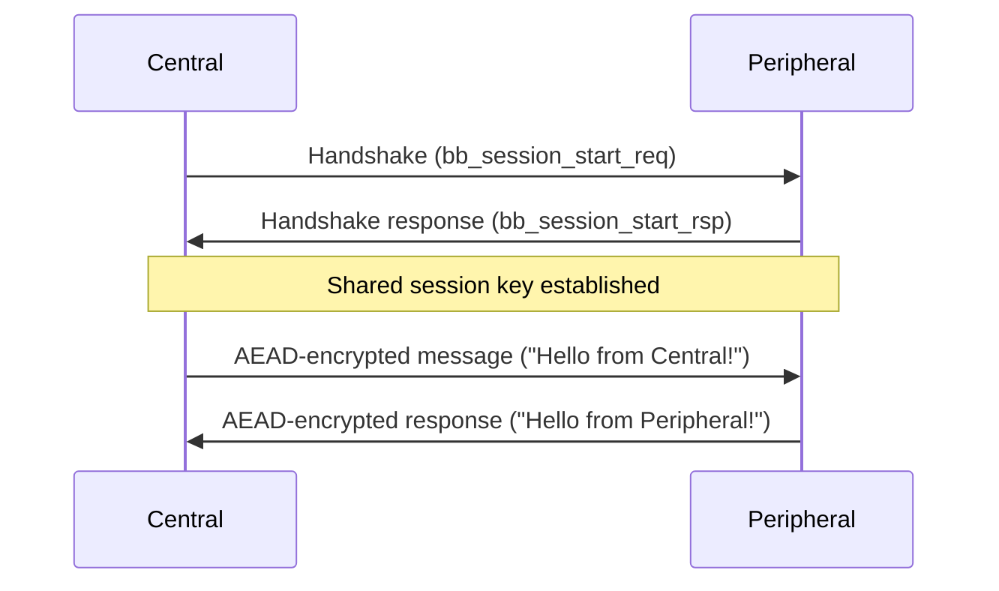

# BB-Protocol AEAD Encryption Example

This example demonstrates secure Bluetooth L2CAP communication using the BB protocol with AEAD encryption between two RPi devices.

AEAD is the *Authenticated encryption with associated data* allowing recipient to can check the integrity of both the associated data and the confidential information in a message.


## AEAD Properties
- **Confidentiality**: Plaintext is encrypted and unreadable without key
- **Authenticity**: Any tampering with ciphertext is detected
- **Associated Data**: Metadata is authenticated but not encrypted

## Counter Management

**Current Implementation**
```c
// Both sides use state.counter
// Central: 0 (send), 1 (receive)
// Peripheral: 0 (receive), 1 (send)
```

**Key Points**
- **Nonce Uniqueness**: Each message must use a unique nonce with the same key
- **Synchronization**: Both sides must use the same counter value for encrypt/decrypt
- **Order**: Counter increments after each send operation
- **Security**: Reusing nonce with same key breaks AEAD security


## Security Note

⚠️ **Warning**: This example uses the same counter space for both sides, which works for this simple back-and-forth pattern but could lead to nonce reuse in more complex scenarios.


## 🚀 Get Started!

### Prerequisites

To enable the BB-protocol on RPi's, follow [BB-protocols over L2CAP for Bluetooth Classic (BR/EDR)](../../BB_BRINGUP.md) instructions.

### Files

- `central.c` - L2CAP client that initiates connection and sends encrypted messages
- `peripheral.c` - L2CAP server that receives and responds with encrypted messages

### Build and Run
```bash
# Terminal 1 (Peripheral)
cmake .
make peripheral
sudo ./bin/peripheral

# Terminal 2 (Central)
cmake .
make central
sudo ./central <peripheral_bluetooth_address>
```

### Expected Output
```
# Peripheral side
Handshake complete, key: [32 hex bytes]
Received: Hello from Central!

# Central side
Handshake complete, key: [32 hex bytes]
Received: Hello from Peripheral!
```


## How AEAD Encryption Works

### AEAD Function Signatures

```c
size_t aead_encrypt(uint8_t* out,
                    uint8_t* key,
                    uint64_t nonce,
                    const uint8_t* ad,
                    size_t ad_len,
                    const uint8_t* in,
                    size_t in_len);

size_t aead_decrypt(uint8_t* out,
                    uint8_t* key,
                    uint64_t nonce,
                    const uint8_t* ad,
                    size_t ad_len,
                    const uint8_t* in,
                    size_t in_len);
```

### Parameters Explained

- **`out`**: Output buffer for encrypted/decrypted data
- **`key`**: 32-byte encryption key (derived from BB handshake)
- **`nonce`**: 64-bit counter used as nonce (must be unique per message)
- **`ad`**: Associated data (authenticated but not encrypted)
- **`ad_len`**: Length of associated data
- **`in`**: Input plaintext/ciphertext
- **`in_len`**: Length of input data

### AEAD Encryption/Decryption Data Flow



*Figure: AEAD encryption and decryption process for each message exchanged.*

## Message Flow

### 1. Central Sends Message

```c
// In central.c
uint8_t plaintext[] = "Hello from Central!";
uint8_t ciphertext[sizeof(plaintext) + TAG_LEN];
uint8_t associated_data[] = "message_type_1";

// Encrypt the message
size_t encrypted_len = aead_encrypt(ciphertext,
                                    state.key,
                                    state.counter,
                                    associated_data,
                                    sizeof(associated_data)-1,
                                    plaintext,
                                    sizeof(plaintext)-1);

// Send encrypted message
if (send(sock, ciphertext, encrypted_len, 0) <= 0) {
    perror("failed to send encrypted data");
}
state.counter++; // Increment counter after sending
```

**What happens:**
- Plaintext "Hello from Central!" is encrypted using the shared key
- `state.counter` is used as the nonce (starts at 0 after handshake)
- Associated data "message_type_1" is authenticated but not encrypted
- Output includes both ciphertext and authentication tag
- Counter is incremented to ensure next message uses different nonce

### 2. Peripheral Receives Message

```c
// In peripheral.c
uint8_t receive_buffer[128] = {0};
uint8_t decrypted_message[128] = {0};
uint8_t associated_data[] = "message_type_1";

int received_len = recv(client_socket,
                        receive_buffer,
                        sizeof(receive_buffer),
                        0);

if (received_len > 0) {
    size_t decrypted_len = aead_decrypt(decrypted_message,
             state.key,
             state.counter,
             associated_data,
             sizeof(associated_data)-1,
             receive_buffer,
             received_len);

    printf("Received: %s\n", decrypted_message);
}
```

**What happens:**
- Receives encrypted data from central
- Uses same key and counter value (0) to decrypt
- Same associated data must be provided for authentication
- If decryption succeeds, original plaintext is recovered
- If authentication fails, decryption returns 0

### 3. Peripheral Sends Response

```c
// In peripheral.c
state.counter++; // Increment counter after receiving

uint8_t response[] = "Hello from Peripheral!";
uint8_t ciphertext[sizeof(response) + TAG_LEN];

size_t encrypted_len = aead_encrypt(ciphertext,
                                    state.key,
                                    state.counter,
                                    associated_data,
                                    sizeof(associated_data)-1,
                                    response,
                                    sizeof(response)-1);

if (send(client_socket, ciphertext, encrypted_len, 0) <= 0) {
    perror("failed to send encrypted response");
}
```

**What happens:**
- Counter is incremented to 1 before sending response
- Response "Hello from Peripheral!" is encrypted with counter=1
- Same associated data and key are used

### 4. Central Receives Response

```c
// In central.c
uint8_t receive_buffer[128] = {0};
uint8_t decrypted_message[128] = {0};

int received_len = recv(sock, receive_buffer, sizeof(receive_buffer), 0);
if (received_len > 0) {
    size_t decrypted_len = aead_decrypt(decrypted_message, state.key,
                                       state.counter,
                                       associated_data,
                                       sizeof(associated_data)-1,
                                       receive_buffer, received_len);

    printf("Received: %s\n", decrypted_message);
}
```

**What happens:**
- Central uses `state.counter` (now 1) to decrypt response
- Must match the counter value used by peripheral for encryption
- Recovers "Hello from Peripheral!" message

### Encrypted Message Exchange Sequence



*Figure: Secure handshake and encrypted message exchange using AEAD and the shared session key.*

