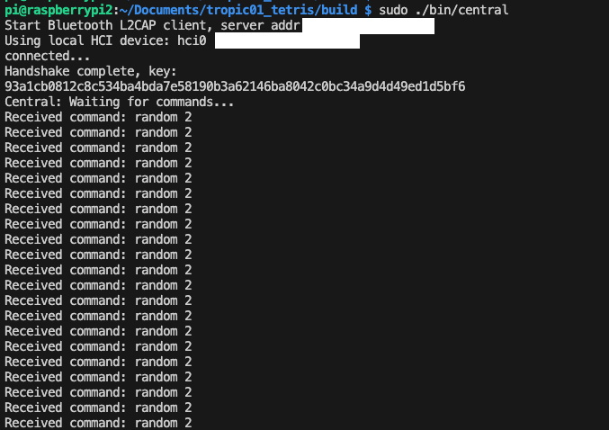
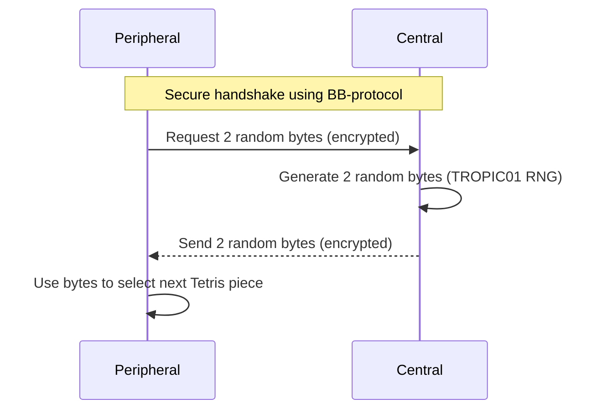

# TROPIC01 Tetris Demo

This project demonstrates secure, encrypted inter-device communication using the BB-protocol over Bluetooth Classic (BR/EDR), featuring a Tetris game. The demo is based on [Tetris200lines by @najibghadri](https://github.com/najibghadri/Tetris200lines/tree/master) and extends it to run securely between two devices using the BB-protocol for encrypted communication.


## The Game Flow

- Whenever the Tetris game on the peripheral needs a new piece, it requests **two random bytes** from the central device.
- The central device generates these two bytes using the TROPIC01 hardware random number generator.
- The random bytes are sent back to the peripheral, **encrypted and authenticated** using the BB-protocol.
- The peripheral uses these bytes to determine the next Tetris piece, ensuring that the random number source is both secure and verifiable.

<table>
  <tr>
    <td align="center">
      <br/>
      <sub>Central device interface (random number provider)</sub>
    </td>
    <td align="center">
      <br/>
      <sub>Peripheral device interface (Tetris game UI)</sub>
    </td>
  </tr>
</table>


## How It Works

- The **peripheral** runs the Tetris game and requests random numbers from the central device to generate new Tetris pieces.
- The **central** device acts as a secure random number provider (and can be extended to provide other secure hardware-backed operations).
- All requests and responses are sent as encrypted messages using the BB-protocol. The message format is defined in `tropic_simple.h`.
- The communication flow is:
  1. Devices perform a secure handshake to establish a session key.
  2. The peripheral requests random numbers from the central device as needed for the Tetris game.
  3. The central responds with random data, all over an encrypted channel.




## 🔒 Protocol Security

- **BB-Protocol**: demo uses the BB-protocol for secure, authenticated, and encrypted communication over Bluetooth L2CAP. The protocol is implemented in `bb-lib` and used in `central.c` and `peripheral.c`.
- **Encryption**: All communication between the central and peripheral devices is encrypted. A secure handshake establishes a session key, and all subsequent messages (including Tetris game data and random number requests) are encrypted and authenticated.
- **Communication Channel**: The devices communicate over Bluetooth Classic (BR/EDR) using L2CAP sockets. The channel is protected by the BB-protocol, ensuring confidentiality and integrity.


### Security Note

⚠️ **Warning**: This demo is for educational and demonstration purposes only. Keys are hardcoded and should not be used in production.
- The communication channel is fully encrypted and authenticated using the BB-protocol.


## 🚀 Get Started!

### Prerequisites

To enable the BB-protocol on RPi, follow [BB-protocols over L2CAP for Bluetooth Classic (BR/EDR)](../BB_BRINGUP.md) instructions.
To enable TROPIC01 secure element on the peripheral device, follow [TROPIC01 Secure Element Enablement](../TROPIC01_BRINGUP.md) instructions.

Install the **ncurses** library (for Tetris UI) on the peripheral device:

  ```bash
  sudo apt-get install libncurses5-dev libncursesw5-dev
  ```


### Build and Run

```bash
mkdir build
cd build
cmake ../
make
```


> **⚠️ WARNING:** Depending on your Linux configuration, you may need to pair and "trust" the two devices using Bluez (`bluetoothctl`) before running the demo.

1. **On the Peripheral device:**
   ```bash
   sudo ./bin/peripheral
   ```
2. **On the Central device:**
   ```bash
   sudo ./bin/central <mac_of_peripheral>
   # Replace <mac_of_peripheral> with the Bluetooth MAC address of the peripheral device
   ```

- The executables use hardcoded keys for demonstration purposes and are set up to run the BB-protocol session (bb-session). Pairing is assumed to have already happened.


## Credits

- Tetris game logic adapted from [Tetris200lines by @najibghadri](https://github.com/najibghadri/Tetris200lines/tree/master)

