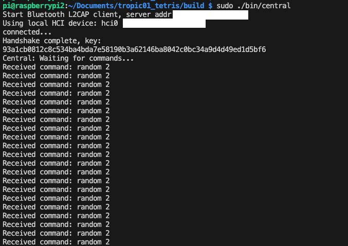
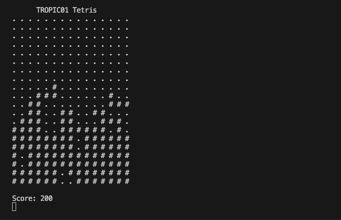

# Tetris Demo with TP01/CORE-V

This project demonstrates secure, encrypted inter-device communication using the BB-protocol over Bluetooth Classic (BR/EDR), featuring a Tetris game. The demo is based on [Tetris200lines by @najibghadri](https://github.com/najibghadri/Tetris200lines/tree/master) and extends it to run securely between two devices using the BB-protocol for encrypted communication.


## The Game Flow

- Whenever the Tetris game on the peripheral needs a new piece, it requests **two random bytes** from the central device.
- The central device generates these two bytes using the TROPIC01 hardware random number generator or the RISC-V emulated Secure Element.
- The random bytes are sent back to the peripheral, **encrypted and authenticated** using the BB-protocol.
- The peripheral uses these bytes to determine the next Tetris piece, ensuring that the random number source is both secure and verifiable.

<table>
  <tr>
    <td align="center">
      <br/>
      <sub>Central device interface (random number provider)</sub>
    </td>
    <td align="center">
      <br/>
      <sub>Peripheral device interface (Tetris game UI)</sub>
    </td>
  </tr>
</table>


## How It Works


The Tetris TP01/CORE-V demonstrator showcases secure Bluetooth communication using the BB-protocol. It consists of two main components:

- **Peripheral Device**: Runs the Tetris game with ncurses interface, acts as a Bluetooth server
- **Central Device**: Acts as a Bluetooth client, can control the game and provide random number generation

The system supports two random number generation modes:
- **CORE-V Mode**: Uses CORE-V hardware random number generation
- **TROPIC01 Mode**: Uses TROPIC01 hardware random number generation

Operation:
- The **peripheral** runs the Tetris game and requests random numbers from the central device to generate new Tetris pieces.
- The **central** device acts as a secure random number provider (and can be extended to provide other secure hardware-backed operations).
- All requests and responses are sent as encrypted messages using the BB-protocol. The message format is defined in `tropic_simple.h`.
- The communication flow is:
  1. Devices perform a secure handshake to establish a session key.
  2. The peripheral requests random numbers from the central device as needed for the Tetris game.
  3. The central responds with random data, all over an encrypted channel.


## Security Considerations

### Current Implementation

- Uses pre-shared keys for demonstration
- Implements BB-protocol for secure communication
- Supports hardware-based random number generation

### Security Note

⚠️ **Warning**: This demo is for educational and demonstration purposes only. Keys are hardcoded and should not be used in production.
- The communication channel is fully encrypted and authenticated using the BB-protocol.

### Production Recommendations

- Implement proper key management and exchange
- Add certificate-based authentication
- Implement secure boot and firmware verification
- Add intrusion detection and monitoring
- Regular security audits and updates


## 🚀 Get Started!

For any issues with the demo build and run process, please consult the [Troubleshooting Guide](TROUBLESHOOTING.md).

### Prerequisites

**The test Environment:**

- **Operating System**: Linux (tested on Ubuntu 20.04+)
- **Architecture**: x86_64 or ARM (Raspberry Pi compatible)
- **Bluetooth**: Built-in or USB Bluetooth adapter with BlueZ support

**Software Dependencies:**

```bash
# Ubuntu/Debian
sudo apt update
sudo apt install build-essential cmake pkg-config libbluetooth-dev libncurses5-dev
```

**Hardware Dependencies**:

- **CORE-V Hardware**: For CORE-V random number generation mode
- **TROPIC01 Hardware**: For TROPIC01 random number generation mode
- **Bluetooth Devices**: Two devices with Bluetooth capability (can be the same device for testing)


**BB-portable:**

BB-portable implements the BB-protocols over L2CAP for Bluetooth Classic (BR/EDR) in the `central.c` and `peripheral.c` files.
It leverages the bb-lib, a C library that implements the underlying cryptographic primitives and protocol logic.


### Build


**Step 1: Clone and Navigate:**

```bash
cd /path/to/Tetris_COREV_TROPIC
```

**Step 2: Build with CMake:**

```bash
# Create build directory (optional, CMake will create one)
mkdir -p build
cd build

# Configure and build
cmake ..
make
```

**Step 3: Verify Build:**

After successful compilation, you should see the following executables in the `bin/` directory:

```bash
ls -la bin/
# Expected output:
# - central
# - peripheral
# - tests
```

**Step 4: Copy Required Files:**

**⚠️ CRITICAL**: For CORE-V mode to work properly, you must copy the `ex_se05x_crypto` executable to the build/bin directory:

```bash
# Copy the CORE-V crypto executable to the build directory
cp ex_se05x_crypto build/bin/
```

This file is essential for CORE-V random number generation and secure element communication.

### Configuration

#### Bluetooth Address Configuration

**⚠️ IMPORTANT**: You must configure the Bluetooth addresses before running the application. The demonstrator works by simply compiling executing the two sources in two distinct devices. It currently requires hardcoding the MAC address.

1. **Find your Bluetooth addresses**:
   ```bash
   hciconfig
   # or
   bluetoothctl show
   ```

2. **Update the addresses in the source code**:

   Edit `central.c` and update the `L2CAP_SERVER_BLUETOOTH_ADDR`:
   ```c
   #define L2CAP_SERVER_BLUETOOTH_ADDR "XX:XX:XX:XX:XX:XX" // Your peripheral device address
   ```

   Edit `peripheral.c` if needed (usually runs on the same device for testing).

#### Cryptographic Keys

The application uses pre-shared cryptographic keys for demonstration purposes. These are hardcoded in both `central.c` and `peripheral.c`:

- **Private Keys**: 32-byte arrays for secure communication
- **Public Keys**: 32-byte arrays for key exchange
- **Remote Public Keys**: Must match between central and peripheral devices

**⚠️ WARNING**: These keys are for demonstration only. In production, implement proper key management.

### Running the Application

**Step 1: Prepare Bluetooth:**

Ensure Bluetooth is enabled:

```bash
# Enable Bluetooth
sudo systemctl start bluetooth
```

**Step 2: Run Peripheral Device:**

On the device that will run the Tetris game:

```bash
# Navigate to build directory
cd build

# Run peripheral (requires sudo for Bluetooth access)
sudo ./bin/peripheral [options]
```

**Peripheral Options**:
- `-c, --corev`: Use CORE-V random number generation (default)
- `-t, --tropic`: Use TROPIC01 hardware random number generation
- `-h, --help`: Show help message

**Examples**:
```bash
# Use TROPIC01 hardware (short option)
sudo ./bin/peripheral -t

# Use TROPIC01 hardware (long option)
sudo ./bin/peripheral --tropic

# Use CORE-V mode (default, explicit)
sudo ./bin/peripheral -c

# Use CORE-V mode (long option)
sudo ./bin/peripheral --corev
```

**Step 3: Run Central Device:**

On the controlling device:

```bash
# Navigate to build directory
cd build

# Run central
sudo ./bin/central "XX:XX:XX:XX:XX:XX" # Your peripheral address
```

**Central Options**:
- **No command-line options available** - the peripheral Bluetooth address is hardcoded in the source code

**⚠️ IMPORTANT**: The central device uses a hardcoded Bluetooth address defined in `central.c`. You must edit the source code to change the target address:

```c
#define L2CAP_SERVER_BLUETOOTH_ADDR "XX:XX:XX:XX:XX:XX" // Your peripheral address
```

**Step 4: Establish Connection:**

1. The peripheral device will start listening for connections
2. The central device will attempt to connect using the provided address
3. Once connected, the secure BB protocol handshake will occur
4. The Tetris game will be ready for play

### Game Controls

#### Peripheral Device (Game Display)

The Tetris game runs on the peripheral device with the following controls:

- **W**: Rotate piece
- **A**: Move piece left
- **S**: Move piece down
- **D**: Move piece right

#### Central Device (Controller)

The central device can send commands to control the game:

- **Movement Commands**: Send directional commands to the peripheral
- **Random Number Generation**: Request random numbers from hardware
- **Status Monitoring**: Monitor game state and connection status


## Important Notes

### CORE-V Random Number Generation Workaround

**⚠️ CRITICAL LIMITATION**: The current implementation has important limitations regarding CORE-V random number generation:

#### First Run Behavior
- On the **first run** with CORE-V mode (`-c` or `--corev`), the system will:
  1. Execute `ex_se05x_crypto` to establish NSCP (NXP Secure Connectivity Protocol) session
  2. Generate and save randomness data to `corev_random.txt` file
  3. Use this saved randomness for the game

#### Subsequent Runs
- **No resume function is implemented** - the system cannot re-establish the NSCP session
- The application will reuse the randomness from the saved `corev_random.txt` file
- **This is a security limitation** as randomness is not truly random on subsequent runs

#### FPGA Power Cycle Requirement
**⚠️ MANDATORY**: After each run of the program, you **MUST** perform a complete power cycle of the FPGA hardware:

```bash
# After running the application:
# 1. Stop the application (Ctrl+C or 'q' to quit)
# 2. Power off the FPGA completely
# 3. Wait at least 10 seconds
# 4. Power on the FPGA
# 5. Wait for FPGA to fully initialize
# 6. Then you can run the application again
```

#### Randomness File Management
- The `corev_random.txt` file contains hexadecimal random data
- File position is tracked globally and wraps around after 3000 characters
- For security testing, you may want to delete this file between runs to force regeneration

#### Production Considerations
- This workaround is **for demonstration purposes only**
- Production systems should implement proper NSCP session management
- Consider implementing secure random number caching with proper expiration
- Add session resumption capabilities for the secure element

### TROPIC01 Mode
- TROPIC01 mode (`-t` or `--tropic`) does not have these limitations
- Each random number request generates fresh randomness via `lt-util`
- No power cycle is required between runs

## Credits

- Tetris game logic adapted from [Tetris200lines by @najibghadri](https://github.com/najibghadri/Tetris200lines/tree/master)


